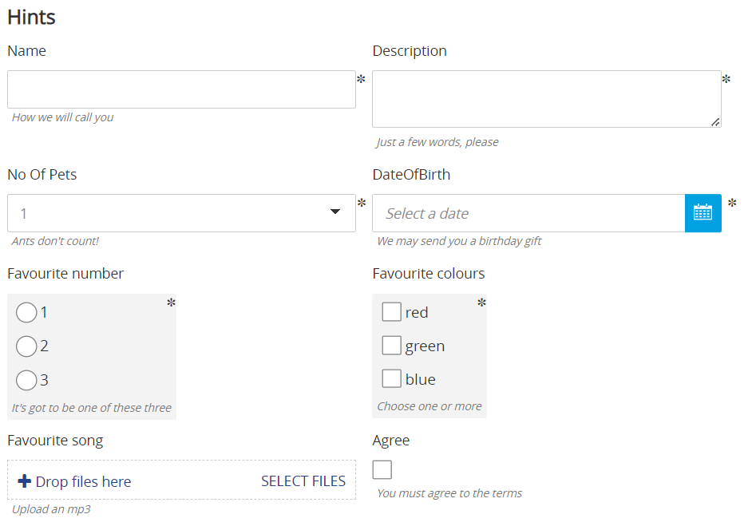
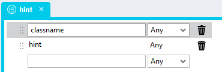

# Form Field Hints

Sometimes we might want to help users complete a form field by providing some additional information in the form of a hint placed under the field. 



## Version 
1.0 - initial

1.1 added check for array; changed px to rem; updated readme to 6.12+

1.2 Integrated CSS with script

# Setup

## Global Script
1. Create a Global Script called "Hints"
2. Add the input parameters below to the Global Script
   1. Hints
3. Drag a *JavaScript* action into the script
4. Add the Javascript below unchanged into the JavaScript code property
```javascript
/* Stadium Script v1.2 https: //github.com/stadium-software/form-field-hints */
let vals = ~.Parameters.Input.Hints;
if (!Array.isArray(vals)) vals = [];
loadCSS();
vals.forEach(function (ob) {
    let elParent = document.querySelector("." + ob.classname);
    if (elParent) {
        let hint = document.createElement("div");
        hint.classList.add("stadium-hint");
        hint.textContent = ob.hint;
        elParent.appendChild(hint);
    }
});
function loadCSS() {
    let moduleID = "stadium-form-field-hints";
    if (!document.getElementById(moduleID)) {
        let cssMain = document.createElement("style");
        cssMain.id = moduleID;
        cssMain.type = "text/css";
        cssMain.textContent = `
/* Stadium CSS v1.0  */
.stadium-hint {
	font-size: var(--hint-font-size, var(--FONT-SIZE-SMALLER));
	font-style: var(--hint-font-style, italic);
	color: var(--hint-font-color, var(--X-DARK-GREY));
	padding: var(--hint-top-padding, 0.2rem) var(--hint-right-padding, 0.6rem) var(--hint-bottom-padding, 0.4rem) var(--hint-left-padding, 0.4rem);
}
.has-validation-error .stadium-hint {
	display: none;
}
.required-indicator:has(.stadium-hint) {
	position: relative;
}
.required-indicator:has(.stadium-hint):after {
	top:0;
	right:0;
}
html {
    min-height: 100%;
    font-size: 62.5%;
}        
        `;
        document.head.appendChild(cssMain);
    }
}
```

## Type
1. Add a type called "hint"
   1. classname (any)
   2. hint (any)



## Page
1. Drag a form field to the page (e.g. CheckBox, CheckBox List, Date Picker, Drop Down, Radio Button List, Text Box or Upload File)
2. Add a class to the field to uniquely identify the field

## Page.Load
1. Drag a *List* action into the event handler and call it "HintsList"
2. Assign the "hint" type to the List in the *Item Type* property
3. Add the field classes and related hints to the "HintsList" (example below)

```json
[{
	"classname": "name",
	"hint": "How we will call you"
}]
```

4. Drag the Global Script called "Hints" into the Event Handler
5. Assign the "HintsList" to the Global Script "Hints" input parameter

## CSS
Variables exposed in the [*hints-variables.css*](hints-variables.css) file can be [customised](#customising-css).

### Customising CSS
1. Open the CSS file called [*hints-variables.css*](hints-variables.css) from this repo
2. Adjust the variables in the *:root* element as you see fit
3. Stadium 6.12+ users can comment out any variable they do **not** want to customise
4. Add the [*hints-variables.css*](hints-variables.css) to the "CSS" folder in the EmbeddedFiles (overwrite)
5. Paste the link tag below into the *head* property of your application (if you don't already have it there)
```html
<link rel="stylesheet" href="{EmbeddedFiles}/CSS/hints-variables.css">
``` 
6. Add the file to the "CSS" inside of your Embedded Files in your application

## Upgrading Stadium Repos
Stadium Repos are not static. They change as additional features are added and bugs are fixed. Using the right method to work with Stadium Repos allows for upgrading them in a controlled manner. 

How to use and update application repos is described here: [Working with Stadium Repos](https://github.com/stadium-software/samples-upgrading)